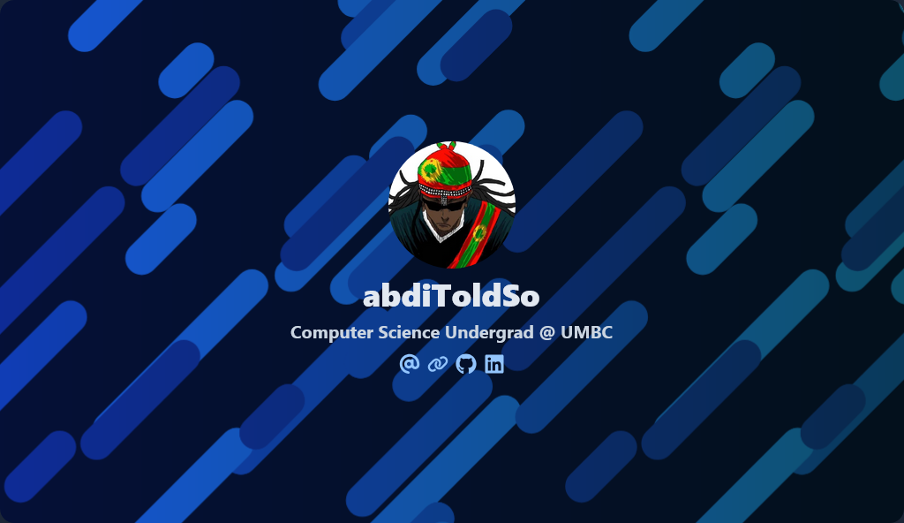

<ul>
  
<h1>👋 Hi, I'm Abdi!</h1>

  
<h6>Pronounced: Ab-Dee</h6>

</ul>

  

- 🔭 I’m currently working on [DesmoC](https://github.com/abdiToldSo/DesmoC) & [Joey, a Sequencer for the Koala DAW](https://github.com/abdiToldSo/Joey-Koala-Sequencer-)
- 🌱 I’m currently learning **Go, Backend Technologies, & Whatever I find interesting 😃**
- 👨‍💻 All of my projects are available at [https://github.com/abdiToldSo](https://github.com/abdiToldSo)
- 📫 How to reach me **abditolessa@proton.me**

<h3 align="left">Connect with me:</h3>

<h3 align="left">Languages and Tools:</h3>

           

